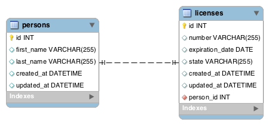

# java_driversLicense

## License Assignment
In this assignment, you will be creating an application that will allow users to create licenses for every person.

**ERD and Wireframe**



**Topics:**

● 1:1 relationships

● JPA methods

**Tasks:**

● Allow users to create a new person with their first name and last name

● Allow users to create a license with the state and expiration date; however the license number is done by the server. The first person in the DB has a license number of 000001. Increment by 1 every time a new person is added.

● Have a person's show page that will retrieve their name, license number, license state, and license expiration date

**.war File**

To test if you have completed this assignment correctly, we have created a project that simply displays all the people in your database with their license information.

warproject

First download this .war file: [license-0.0.1-SNAPSHOT.war](https://github.com/itzedu/warFiles/raw/master/license-0.0.1-SNAPSHOT.war). Now, you can run ```java -jar license-0.0.1-SNAPSHOT.war``` and it will start this Spring Boot project on port 3000. Visit localhost:3000 and you should see the picture above but with the information of your database. If not, you have added people and licenses incorrectly. **Make sure that your schema in your MySQL database is called 'relationships'.**